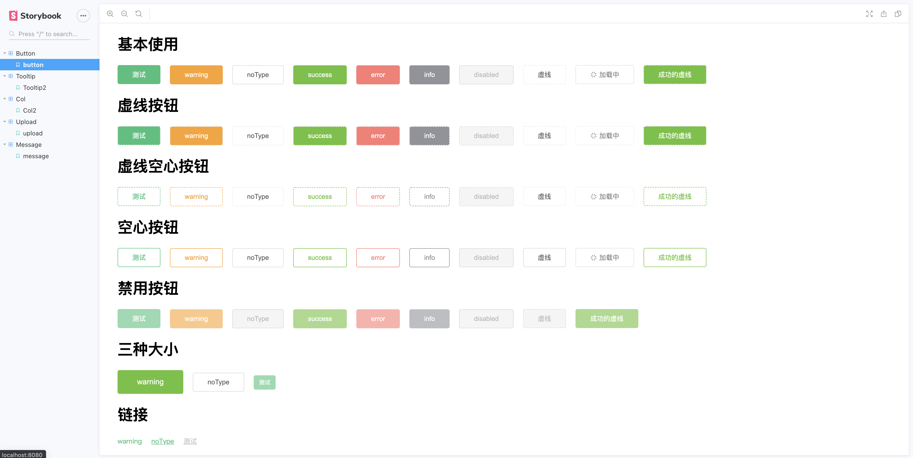
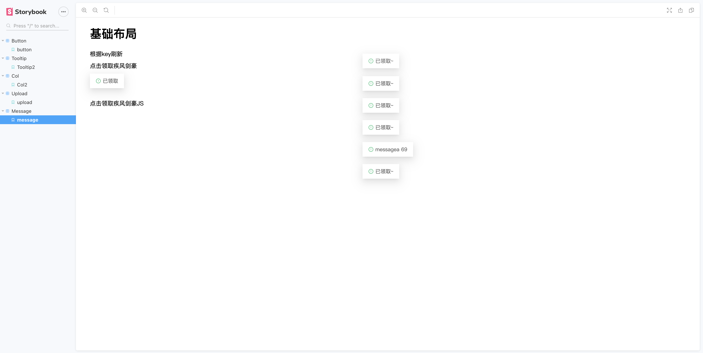
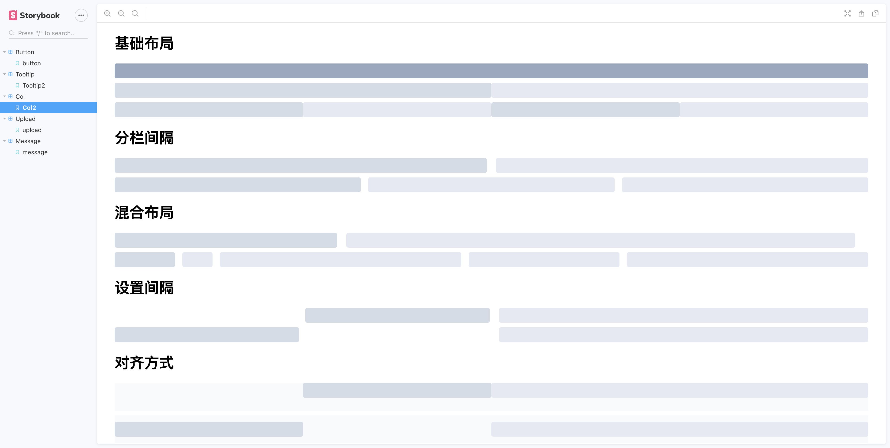

### 介绍

由于没有经手过react项目，就想到模仿Ant Design的组件库来熟悉react的使用，同时学习UI库的知识。

### 运行项目

```javascript
// 第一次安装依赖 
npm i
// 运行项目
npm run dev
```


### 已完成内容

+ button
  
+ tooltip
  
+ upload
+ message
  
+ col
  
